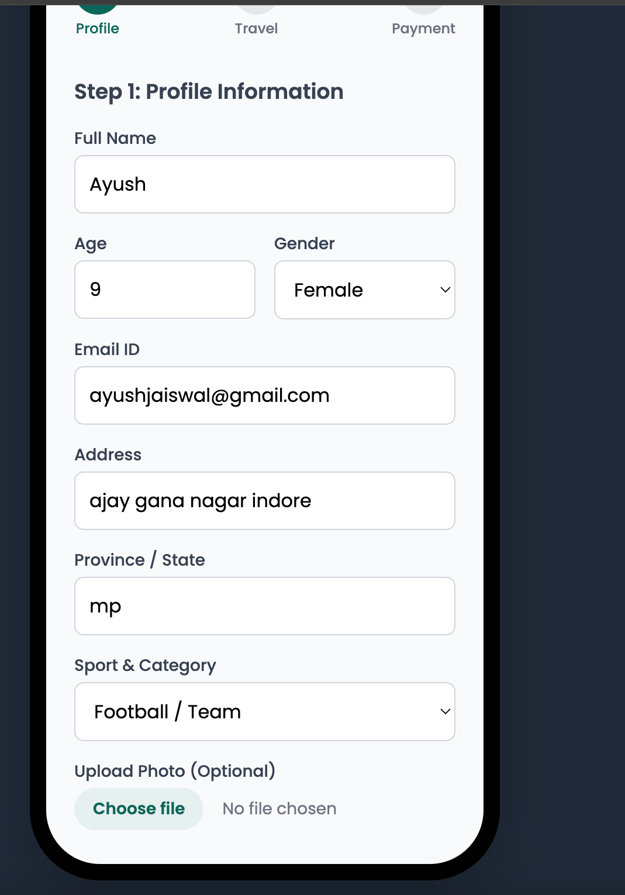
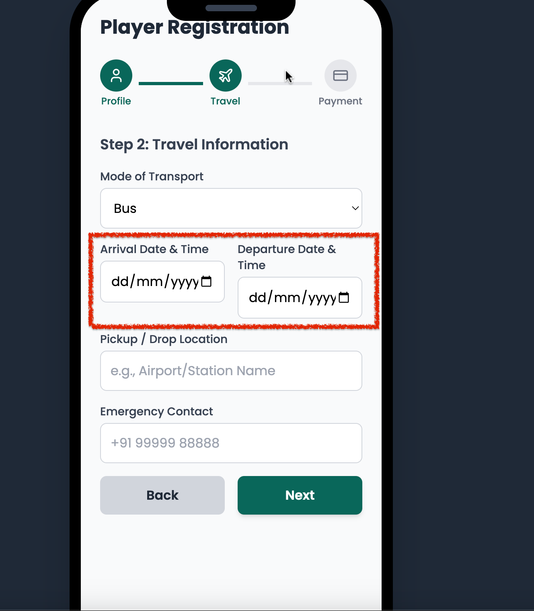
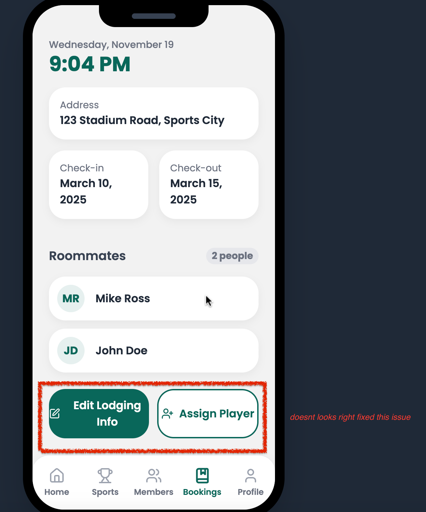

# Project Name

A brief description of the project.

---

## 1. UI Fix Issues

During development, several UI issues were identified and fixed. Below is a detailed list of problems along with screenshots.

### Step 1
- **Issue:** Next button was not visible in the multi-step form.  
- **Fix:** Updated styling and layout to make the button visible.  
- **Screenshot:**  
  

### Step 2
- **Issue:** Date input fields were not user-friendly.  
- **Fix:** Added proper formatting, spacing, and consistent styling.  
- **Screenshot:**  
  

### Step 3
- **Issue:** No spacing between navigation components.  
- **Fix:** Added consistent padding and margins between nav items.  
- **Screenshot:**  
  

### Step 4
- **Issue:** Buttons like "Edit Info", "Login Info", and "Assign Player" were not user-friendly.  
- **Fix:** Redesigned buttons with proper colors, padding, and icons.  
- **Screenshot:**  
  

### Step 5
- **Issue:** Dashboard sections (My Profile, My Spot, Match, Login Details, Food Menu) were not consistent in size.  
- **Fix:** Standardized card sizes and spacing for all dashboard sections.  
- **Screenshot:**  
  

there are more i didnt list
---

## 2. Features Implemented (UI Improvements)

- Multi-step form navigation improved (Next/Previous buttons visible and styled)  
- Date inputs are now readable and user-friendly  
- Navigation components properly spaced  
- Action buttons redesigned: "Edit Info", "Login Info", "Assign Player"  
- Dashboard sections standardized for consistent sizing and alignment  
- Overall UI theme created from scratch for a clean, professional look  

---

> **Tip:** Screenshots should be placed in an `assets` folder in your project and referenced relative to the README.md file.  

